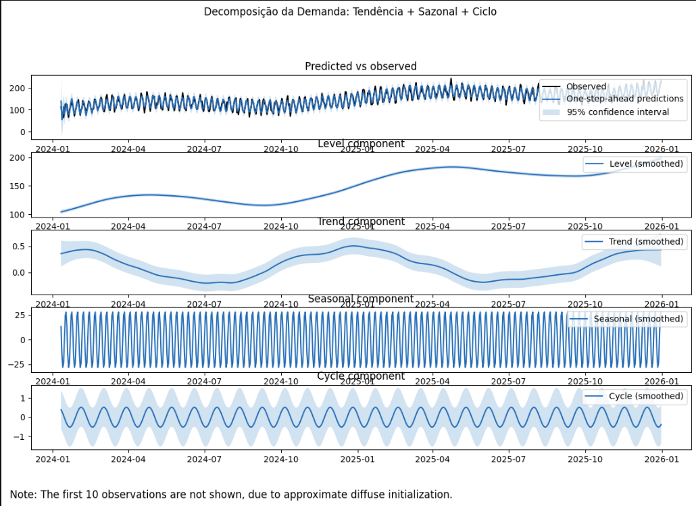
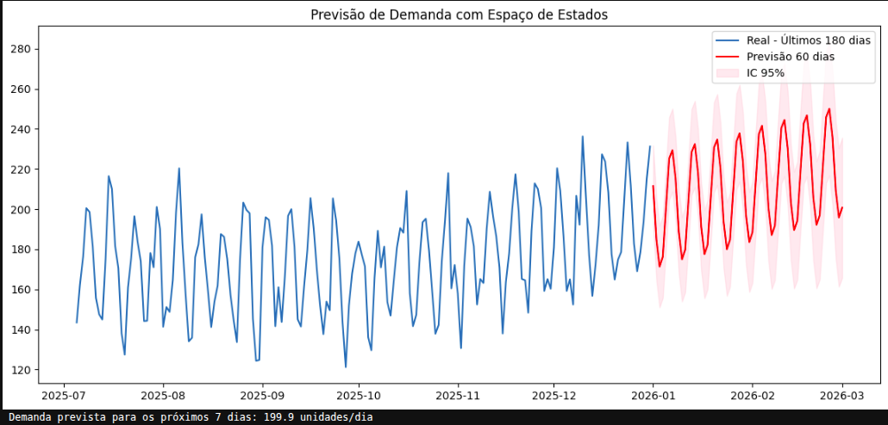

# Previsão de Demanda com Modelos de Espaço de Estados

## 1. Objetivo

<p align="justify">
Este projeto demonstra como utilizar um Modelo de Espaço de Estados (State Space Model - SSM) para realizar previsão de demanda em séries temporais. O exemplo simula dois anos de vendas diárias contendo tendência crescente, sazonalidade semanal, um componente cíclico e ruído aleatório. Em seguida, o modelo estima automaticamente esses componentes latentes e produz previsões para os sessenta dias seguintes juntamente com intervalos de confiança de 95%, permitindo quantificar a incerteza associada às estimativas.
</p>

---

## 2. Estrutura do Projeto

```text
state-space-demand/
│
├── explicando_series_temporais.ipynb
├── README.md
├── fig1.png
└── fig2.png
```

---

## 3. Tecnologias Utilizadas

- Python
- NumPy
- Pandas
- Matplotlib
- Statsmodels

---

## 4. Geração da Série Temporal

<p align="justify">
A primeira etapa consiste na criação de uma base sintética de demanda diária ao longo de dois anos. A série é construída combinando quatro componentes fundamentais:
</p>

- tendência crescente;
- sazonalidade semanal;
- componente cíclico;
- ruído aleatório.

<p align="justify">
Esse processo gera uma série temporal semelhante ao comportamento encontrado em problemas reais de previsão de vendas, permitindo avaliar a capacidade do modelo em identificar simultaneamente diferentes padrões presentes nos dados.
</p>

---

## 5. Construção do Modelo de Espaço de Estados

<p align="justify">
Após a geração da série temporal, é ajustado um modelo <em>Unobserved Components</em> da biblioteca Statsmodels. Diferentemente de métodos tradicionais de decomposição, esse modelo representa a série como a soma de componentes latentes que evoluem dinamicamente ao longo do tempo. Esses componentes não são observados diretamente, mas são estimados durante o treinamento por máxima verossimilhança utilizando o Filtro de Kalman.
</p>

<p align="justify">
Neste projeto são considerados:
</p>

- tendência local linear;
- sazonalidade semanal;
- componente cíclico.

<p align="justify">
Ao final do treinamento, o modelo estima automaticamente o comportamento de cada componente e suas respectivas variâncias, possibilitando tanto a interpretação da série quanto a realização de previsões probabilísticas.
</p>

---

## 6. Por que utilizar Modelos de Espaço de Estados?

<p align="justify">
Embora tanto os Modelos de Espaço de Estados quanto técnicas de decomposição clássica, como STL ou filtros de Hodrick-Prescott, sejam capazes de separar tendência, sazonalidade e ruído, seus objetivos são bastante diferentes.
</p>

<p align="justify">
As técnicas de decomposição são essencialmente descritivas. Elas funcionam como um "raio-X" da série temporal, permitindo compreender quais componentes explicam o comportamento observado no passado. Entretanto, não possuem um mecanismo probabilístico próprio para extrapolar esses componentes para o futuro. Caso seja necessária uma previsão, normalmente é preciso construir modelos adicionais para tendência e sazonalidade.
</p>

<p align="justify">
Os Modelos de Espaço de Estados seguem uma abordagem dinâmica. Em vez de apenas decompor os dados históricos, assumem que existe um estado oculto da série — formado pelo nível, tendência, sazonalidade e demais componentes — que evolui continuamente ao longo do tempo segundo um modelo probabilístico. Dessa forma, o algoritmo estima o estado atual da série e utiliza essa informação para prever estados futuros.
</p>

<p align="justify">
Outra diferença importante está no tratamento da incerteza. Em técnicas clássicas de decomposição, intervalos de confiança precisam ser obtidos por métodos adicionais, como bootstrap ou hipóteses sobre os resíduos. Nos Modelos de Espaço de Estados, essa incerteza faz parte da própria modelagem estatística. O Filtro de Kalman atualiza continuamente tanto a estimativa dos estados quanto sua variância, permitindo que os intervalos de confiança aumentem naturalmente à medida que o horizonte de previsão cresce.
</p>

<p align="justify">
Além disso, Modelos de Espaço de Estados apresentam elevada capacidade de adaptação. Sempre que novas observações são incorporadas, o modelo atualiza automaticamente suas estimativas sem necessidade de reconstruir toda a decomposição. Essa característica os torna especialmente adequados para ambientes onde padrões de demanda mudam ao longo do tempo devido à sazonalidade, mudanças de mercado ou alterações no comportamento dos consumidores.
</p>

### Comparação entre as abordagens

| Característica | Decomposição Clássica | Modelo de Espaço de Estados |
| :--- | :--- | :--- |
| Objetivo | Analisar o comportamento histórico | Realizar previsão probabilística |
| Natureza | Descritiva e estática | Dinâmica e estocástica |
| Tendência | Estimada apenas para o histórico | Evolui ao longo do tempo |
| Sazonalidade | Componente fixo | Estado latente atualizado continuamente |
| Intervalos de confiança | Exigem métodos adicionais | Calculados naturalmente pelo modelo |
| Atualização | Reprocessa toda a série | Atualização recursiva com novos dados |
| Aplicação principal | Diagnóstico | Forecast e suporte à decisão |

---

## 7. Decomposição dos Componentes

<p align="justify">
Após o treinamento, o modelo permite visualizar separadamente cada componente estimado da série temporal. Essa decomposição não corresponde apenas a uma separação visual dos dados, mas sim à estimativa dos estados latentes responsáveis pela geração da série observada.
</p>

<p align="justify">
A decomposição facilita compreender quanto da demanda é explicado pela tendência de longo prazo, pela sazonalidade recorrente, pelos ciclos presentes nos dados e pelo componente aleatório não explicado pelo modelo.
</p>

<p align="justify">
A Figura 1 apresenta essa decomposição estimada automaticamente pelo Modelo de Espaço de Estados.
</p>

<p align="center">

</p>

---

## 8. Previsão de Demanda

<p align="justify">
Com o modelo treinado, é realizada uma previsão para os sessenta dias seguintes. Diferentemente de abordagens puramente descritivas, o Modelo de Espaço de Estados projeta a evolução futura dos estados latentes da série, produzindo estimativas consistentes para cada período futuro.
</p>

<p align="justify">
Além da previsão pontual da demanda, são calculados intervalos de confiança de 95%, fornecendo uma medida estatística da incerteza associada às previsões. Esses intervalos tornam-se progressivamente mais amplos conforme aumenta o horizonte de previsão, refletindo o crescimento natural da incerteza em processos temporais.
</p>

---

## 9. Visualização do Forecast

<p align="justify">
A Figura 2 compara os dados históricos com a previsão produzida pelo modelo. A linha vermelha representa a demanda prevista, enquanto a região sombreada corresponde ao intervalo de confiança de 95%, indicando a faixa na qual a demanda futura provavelmente estará considerando a variabilidade estimada pelo modelo.
</p>

<p align="center">

</p>

---

## 10. Aplicações

<p align="justify">
Modelos de Espaço de Estados são amplamente utilizados em problemas de previsão devido à capacidade de separar componentes latentes, incorporar incertezas e adaptar continuamente suas estimativas à medida que novos dados são observados.
</p>

- previsão de vendas;
- planejamento de estoques;
- demanda logística;
- consumo de energia;
- séries financeiras;
- indicadores econômicos;
- monitoramento de processos industriais;
- manutenção preditiva;
- previsão de tráfego.

---

## 11. Conclusão

<p align="justify">
Os Modelos de Espaço de Estados constituem uma das abordagens mais completas para previsão de séries temporais, pois unem interpretação estatística, capacidade preditiva e quantificação explícita da incerteza. Diferentemente de métodos de decomposição clássica, que possuem caráter essencialmente descritivo, os SSM modelam a evolução dinâmica dos componentes da série e permitem projetar seu comportamento futuro de maneira probabilística.
</p>

<p align="justify">
No contexto comercial, essas previsões permitem direcionar campanhas promocionais para períodos de baixa demanda, reforçar ações de marketing em momentos estratégicos, ajustar níveis de estoque antes de picos sazonais, otimizar compras junto a fornecedores e planejar equipes de vendas e logística com maior eficiência. Os intervalos de confiança complementam essa análise ao fornecer uma medida objetiva do risco associado às previsões, permitindo decisões mais seguras sobre alocação de recursos e gerenciamento operacional.
</p>

<p align="justify">
Em síntese, enquanto técnicas tradicionais de decomposição ajudam a compreender o comportamento histórico da série, os Modelos de Espaço de Estados fornecem uma estrutura estatística capaz de compreender o passado, estimar o estado atual do sistema e projetar cenários futuros de forma consistente. Essa característica torna os SSM uma ferramenta extremamente valiosa para transformar dados históricos em informações estratégicas para apoio à tomada de decisão baseada em dados.
</p>

